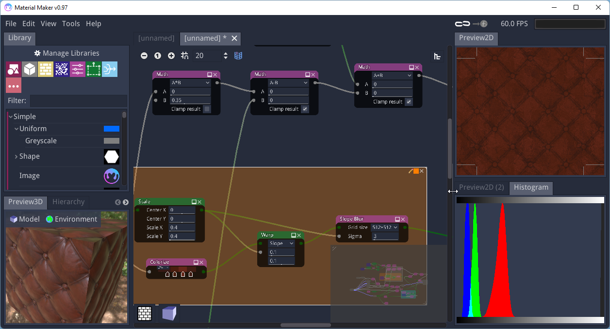

# Material Maker

This is a tool based on [Godot Engine](https://godotengine.org/) that can
be used to create textures procedurally.

Its user interface is based on Godot's GraphEdit node: textures are described
as interconnected nodes.

## Download

- **[Download on itch.io](https://rodzilla.itch.io/material-maker)**

On Windows, you can also install Material Maker using [Scoop](https://scoop.sh):

```text
scoop bucket add extras
scoop install material-maker
```

## Documentation

- **[User manual](https://rodzill4.github.io/material-maker/doc/)**

## Community

- **[Material Maker subreddit](https://www.reddit.com/r/MaterialMaker/)**

## Screenshot



## License

Copyright (c) 2018-2020 Rodolphe Suescun and contributors

Unless otherwise specified, files in this repository are licensed under the
MIT license. See [LICENSE.md](LICENSE.md) for more information.
