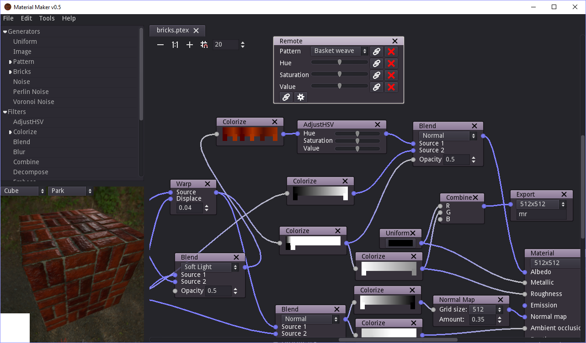

This is a tool based on the Godot game engine that can be used to create textures procedurally. It can also be used as a Godot addon (but there's no good reason for not using it as a standalone tool).

Its user interface is based on Godot's GraphEditor: textures are described as interconnected texture generators and operators.

More details in the [user manual](https://rodzill4.github.io/godot-procedural-textures/doc/).

