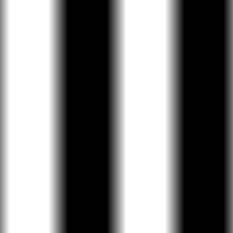

This is an addon for the Godot game engine that can be used to create texture procedurally.

Its user interface is based on Godot's GraphEditor: textures are described as interconnected texture generators and operators.

## Generators

### Image

This operator reads a bitmap from disk

### Pattern

This generator creates a greyscale image by mixing an horizontal and a vertical pattern.
Patterns can either be based on a sine, triangle or square waveform (i.e. the color as function of the x or y coordinate).
The frequency (number of waves per unit) be configure for both axes.
Mix functions can also be configured.

### Bricks

This generator creates bricks greyscale patterns.

The Bricks generator has 5 parameters:
* the number of brick rows
* the number of bricks per row
* the offset between even and odd rows
* the mortar space between bricks
* the bevel at the edge of the bricks

The bricks generator has 2 output:
* the first one will show mortal as black and bricks as white (bevel being shown as a gradient). It can be used as mask to mix brick and mortar, or to generate depth and normal textures
* the second one will just show a different color for each brick. It can be used to affect the brick's colors (and will be used in the future to offset textures).

### Perlin Noise

The Perlin Noise generator creates a greyscale pattern and has 4 parameters:
* the horizontal and vertical scale of the first iteration
* the number of iteration
* the persistence (the weight ratio between 2 iterations)

### Voronoi Noise

The Voronoi Noise generator creates greyscale patterns based on Voronoi diagrams and has 3 parameters:
* the horizontal and vertical scale (the number of feature points)
* the "intensity" of the noise (used to adjust the generated color)

The Voronoi generator has 3 outputs:
* The first output shows a greyscale image where intensity depends on the distance to the cell centers
* The second output shows a greyscale image where intensity depends on the distance to the cell edges
* The third output shows a different color for each cell.

