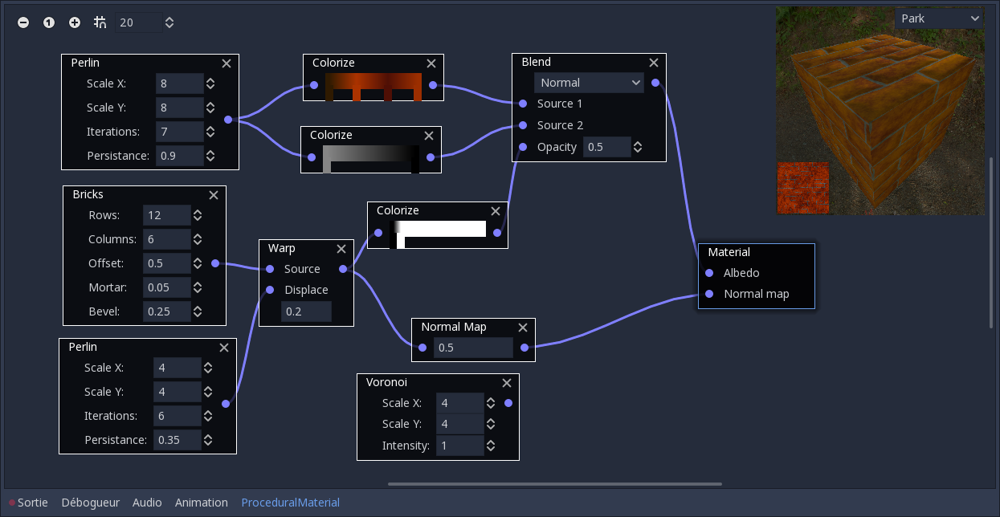
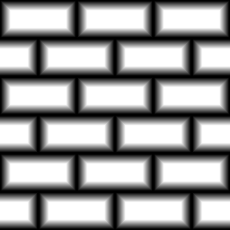
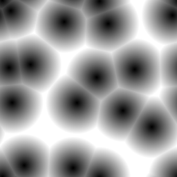
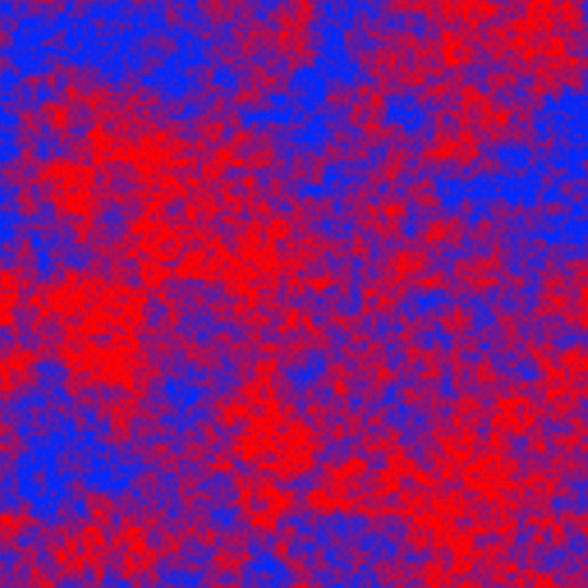
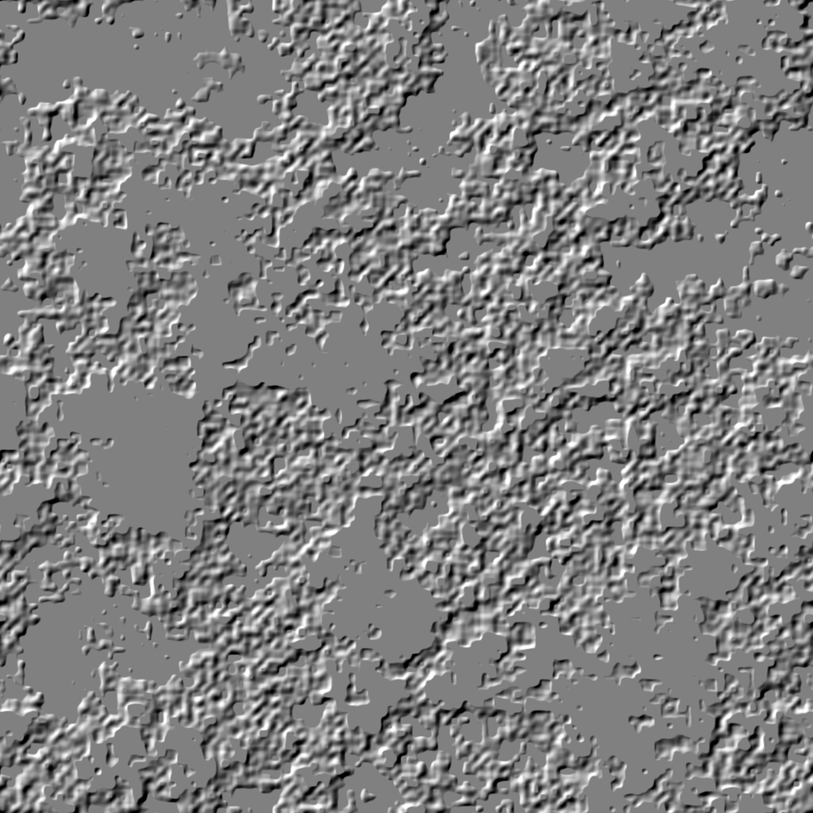

This is atool based on the Godot game engine that can be used to create textures procedurally. It can also be used as a Godot addon (but there's no good reason for not using it as a standalone tool).

Its user interface is based on Godot's GraphEditor: textures are described as interconnected texture generators and operators.

## Generators

### Image

This node reads a bitmap from disk

### Pattern

This generator creates a greyscale image by mixing an horizontal and a vertical pattern.
Patterns can either be based on a sine, triangle, square, saw or "constant" waveform (i.e. the color as function of the x or y coordinate).
The frequency (number of waves per unit) can be configure for both axes.
Mix functions can also be configured.

### Bricks

This generator creates bricks greyscale patterns.

The Bricks generator has 5 parameters:
* the number of brick rows
* the number of bricks per row
* the offset between even and odd rows
* the mortar space between bricks
* the bevel at the edge of the bricks

The bricks generator has 2 output:
* the first one will show mortal as black and bricks as white (bevel being shown as a gradient). It can be used as mask to mix brick and mortar, or to generate depth and normal textures
* the second one will just show a different color for each brick. It can be used to affect the brick's colors (and will be used in the future to offset textures).

### Perlin Noise

The Perlin Noise generator creates a greyscale pattern and has 4 parameters:
* the horizontal and vertical scale of the first iteration
* the number of iteration
* the persistence (the weight ratio between 2 iterations)

### Voronoi Noise

The Voronoi Noise generator creates greyscale patterns based on Voronoi diagrams and has 3 parameters:
* the horizontal and vertical scale (the number of feature points)
* the "intensity" of the noise (used to adjust the generated color)

The Voronoi generator has 3 outputs:
* The first output shows a greyscale image where intensity depends on the distance to the cell centers
* The second output shows a greyscale image where intensity depends on the distance to the cell edges
* The third output shows a different color for each cell.

## Filters

### Colorize

This filter accepts a greyscale image as input and is configured using a gradient. The output image is obtained by applying the gradient to the greyscale image (the example below shows a colorized perlin noise).

### Blend

This filter accepts 2 inputs and an optional mask and blends the 2 images according to the selected blend algorithm.

### Blur

This node applies a Gaussian blur to the input image.

### Combine

This node accepts 3 greyscale images as inputs (one for each R, G and B channels) and combines them into a single image. It is useful to create textures that combine distinct features (for example Metallic and Roughness for Godot's Spatial materials).

### Emboss

This node creates a lighting effect from a greyscale image, with a configurable light direction.

### Normal map

This node creates a normal map from a greyscale height map.

### Transform

This node applies a transform (translation, rotation, and scale) to its input image. Whether the input image is clamped or repeated when downsizing is configurable.

This can be combined with the pattern node to create a great variety of shapes.

### Warp

This node deforms an input image according to the gradient of another image (generally perlin noise).

