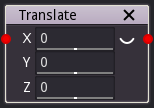

Translate node
..............

The **Translate** node generates a 3D signed distance function of a translated shape
based on its input.

Inputs
::::::

The **Translate** node accepts an input in 3D signed distance function format.

Outputs
:::::::

The **Translate** node generates a signed distance function of the
translated input shape.

Parameters
::::::::::

The **Translate** node accepts *the X, Y and Z components of the translation* as parameters.
