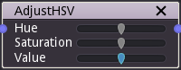

AdjustHSV node
~~~~~~~~~~~~~~

The AdjustHSV node adjusts the hue, saturation and value of the input image.

Inputs
++++++

The AdjustHSV node requires a color input texture.

Outputs
+++++++

The AdjustHSV node provides a single color texture.

Parameters
++++++++++

The AdjustHSV node has the following parameters:
* Hue defines how hue is affected.
* Saturation defines how the colorfulness or the texture is affected.
* Value defunes how the lightness is affected.
