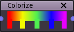

Colorize node
~~~~~~~~~~~~~

The colorize node applies a user-defined gradient to a greyscale image: black pixels
will be colored with the leftmost color of the gradient and white pixels will take
the rightmost color.

Inputs
++++++

The colorize node requires a greyscale input texture.

Outputs
+++++++

The colorize node provides a single color texture.

.. image:: images/colorize.png

Parameters
++++++++++

The colorize node has a single parameter that defines the gradient to be applied to the input image.

Notes
+++++

The input will be considered (and implicitly converted to) greyscale if it is a color texture.