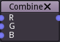

Combine node
~~~~~~~~~~~~

The **Combine** node combines four greyscale inputs into an RGBA output texture.

Inputs
++++++

The combi**Combine**ne node has 3 inputs, one for each (red, green and blue) channel.

Outputs
+++++++

The **Combine** node outputs a color image.
