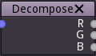

Decompose node
~~~~~~~~~~~~~~

The **Decompose** node decomposes anRGBA input into four greyscale outputs.

Inputs
++++++

The **Decompose** node has a single color input.

Outputs
+++++++

The **Decompose** node outputs 4 greyscale images, one for each (red, green, blue and alpha) channel.
