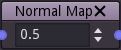
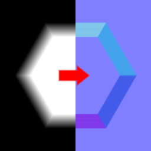

Normal map node
~~~~~~~~~~~~~~~~

The **Normal map** node generates a normal map from its input.

Inputs
++++++

The **Normal map** node accepts a single greyscale image as input, interpreted as a heightmap.

Outputs
+++++++

The **Normal map** node outputs the generated normal map.

Parameters
++++++++++

The **Normal map** node has the following parameters:

* the *format* of the normal map (default, OpenGL or DirectX)

* the *size* of the normal map

* the *strength* of the normal map effect

Notes
+++++

This node outputs an image that has a fixed size.

Example images
++++++++++++++

