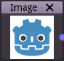

Image node
~~~~~~~~~~

The image node outputs a single texture based on an image file.

Inputs
++++++

The image node does not accept any input.

Outputs
+++++++

The image node provides a single color texture.

Parameters
++++++++++

The image node has a single parameter that defines the image file the node provides.
It can be modified by clicking the thumbnail and selecting a new image file.
