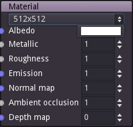

Material node
~~~~~~~~~~~~~

The Material node defines a material using its inputs.

There is one and only one Material node for each Material Maker project,
it is created for each new project and cannot be deleted or duplicated.
When copied and pasted together with other nodes, the Material node will
not be pasted, but connections will be copied if possible.

When exporting a project to PNG files, all inputs are generated as PNG
files whose name is generated using the project name and the name of the
corresponding property in the material.

When using Material Maker as a Godot addon, the metallic, roughness and
ambient occlusion are automatically combined into a single texture, and
a SpatialMaterial is generated automatically.

Inputs
++++++

The Material node has an input for each supported property (albedo, metallic,
roughness, emissive, normal, ambient occlusion and depth maps) of the material.

Outputs
+++++++

The Material node does not have any output.

Parameters
++++++++++

The Material node has parameters:

* The size of the texture files to be generated.

* A color associated to the albedo property. The texture used for the albedo input is multiplied by this color.

* The value of the metallic property of the material. The texture used for the metallic input is multiplied by this value.

* The value of the roughness property of the material. The texture used for the roughness input is multiplied by this value.

* The energy of the emissive property of the material.

* The value of the normal map property of the material. It is used to strengthen or lighten the effect of the normal map.

* The value of the ambient occlusion property of the material. The texture used for the ambient occlusion input is multiplied by this value.

* The value of the depth property of the material. The input depth map is multiplied by this value.

