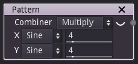

Pattern node
~~~~~~~~~~~~

The Pattern node outputs a pattern texture generated from common waveform shapes.

Inputs
++++++

The Pattern node does not accept any input.

Outputs
+++++++

The Pattern node provides a greyscale texture obtained by mixing a horizontal and a vertical pattern.

Many different patterns can be created using this node, do not hesitate to experiment.

.. image:: images/pattern.png

Parameters
++++++++++

The Pattern node accepts the following parameters:

* the *X* and *Y* parameters define the pattern and their number of repetitions
  that will be propagated along the X axis and Y.
  The following patterns are available:
  
  * Sine: the value follows a sinus waveform
  
  * Triangle: the value follows a triangle waveform (changes linearly from 0 to 1 and from 1 to 0)
  
  * Square: the value follows a square waveform (stays constant at 0, then 1)

  * Sawtooth: the value follows a sawtooth waveform (changes linearly from 0 to 1, then jumps back to 0)

  * constant: the value is 1

* the *Combiner* parameter is the function used to combine the *X* and *Y* patterns. The available
  functions are *multiply*, *add*, *max*, *min*, *xor* and *pow*
