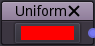

Uniform node
~~~~~~~~~~~~

The uniform node outputs a single uniform image whose color is configurable.

Inputs
++++++

The uniform node does not accept any input.

Outputs
+++++++

The uniform node provides an output that generates a uniform color image.

Parameters
++++++++++

The uniform node has a single *color* parameter that defines the color of the output image.
