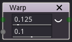

Warp node
~~~~~~~~~

The warp node deforms an input image according to the derivative of the second input image.

Inputs
++++++

The warp node accepts two inputs:

* The *Source* inputs is the image to be deformed.

* The *Displace* input is a greyscale image whose derivative will be used to deform the source.

Outputs
+++++++

The warp node outputs the deformed image.

Parameters
++++++++++

The warp node has the a single parameter that will be used to scale the warp effect.
