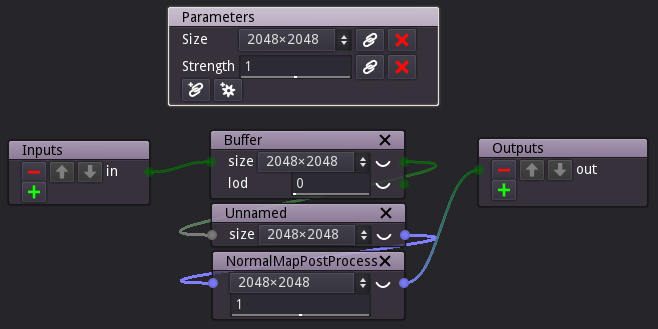

Subgraph nodes
--------------

Subgraphs are parts of a complex material graph that have been gathered into
their own level of hierarchy.

To create a subgraph, first select the nodes that must be grouped and use the
**Tools -> Create group** menu item or the **Control+G** keyboard shortcut.
This will replace all selected nodes with a single subgraph node, without
modifying the overall material description.

The subgraph node is not editable by default, but using the **Control+W**
shortcut will make it possible to edit its contents using the pencil button.

The newly created subgraph contains:

* all nodes that have been grouped
* an **Input** and an **Output** node that rep^resent the inputs and the outputs
  of the subgraph. Selecting them and using the **Control+W** shortcut makes them
  editable so the subgraph inputs and outputs can be added, removed reordered or
  renamed. Please note that all those operations will (when possible) keep
  connectivity inside and outside the subgraph.
* A **Parameters** node that is a **remote** can be edited to expose selected
  parameters to the parent graph. When grouping nodes with a **remote**, the
  remote will automatically be used as **Parameters** node in the nealy created
  subgraph.
