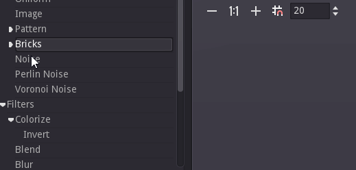
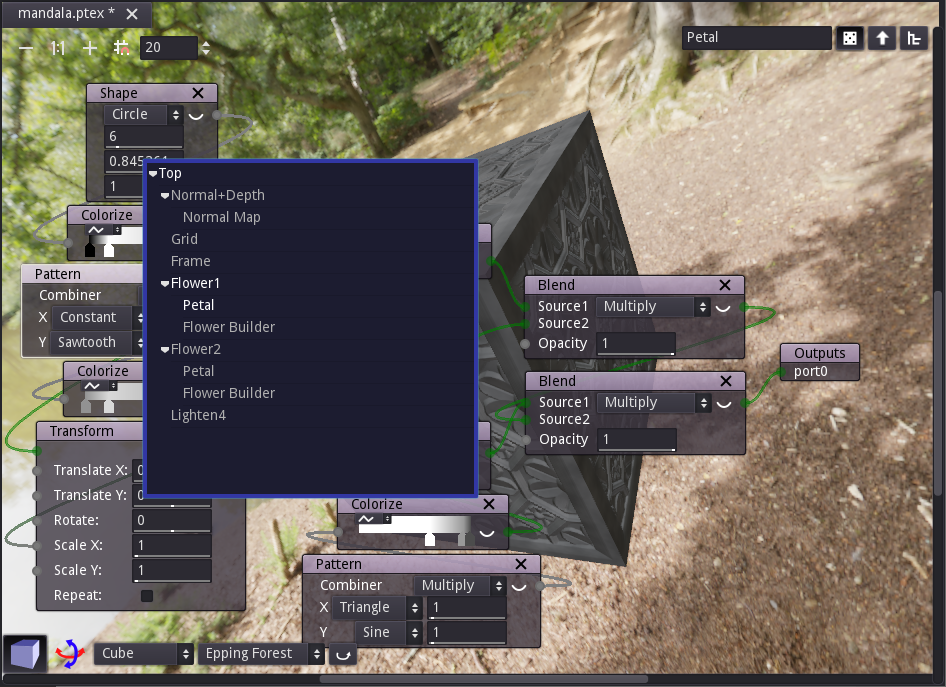
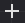
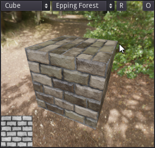

User interface
==============

Overview
--------

Material Maker mainly consists of 3 panes:

* The top left pane is the library, that contains all available nodes that can be used
  to create materials. Library items are shown in a tree view

* The bottom left pane is the preview, that shows at the same time the current material
  applied to a sample mesh in a sample environment, and the texture generated by the
  currently selected node

* The right pane contains the graph editors where materials are described for current
  projects

First steps with the user interface
-----------------------------------

When opening Material Maker, a new empty project is created and shown in the right pane.
An empty project simply consists of a material node where textures for all elements of
the material should be connected.

To create a new node, simply choose one (for example "bricks") from the library (the
top left pane) and drag it into the graph editor. Depending on the selected library
item, a preview or a simple description will be displayed while dragging.

Selecting this new node (by clicking on it) shows it in the preview pane. The very small
2d preview of the preview pane can be maximized by double clicking on it. This will hide
the 3d preview but is useful when working on the different textures of the material.

To connect a node output to an input of another node, simply drag one to the other.
For example we can drag the first output of the Bricks node to the albedo input of
the Materials node. This will automatically assign the simple Bricks texture to the
albedo element of the material, and the 3d preview will immediately be updated (if
you maximized the 2d preview it can be minimized by double-clicking on it again).

Nodes can also be disconnected by dragging a connected input away from its node.

.. image:: images/connect_nodes.gif
  :align: center

Nodes can easily be configured by modifying their parameters, and previews are updated
automatically.

Since each input can be connected to a single output, reconnecting an input will
automatically remove the previous connection.

Graph pane
----------

The graph pane is where materials can be edited, by adding and configuring nodes,
and connecting them.

Grid and zoom
^^^^^^^^^^^^^

.. |zoom_out_button| image:: images/zoom_out_button.png
.. |zoom_reset_button| image:: images/zoom_reset_button.png

.. |grid_button| image:: images/grid_button.png

In the top left corner of the graph pane, the following buttons can be used to modify
the zoom level and configure the grid:

 * the |zoom_out_button| button zooms out.
 * the |zoom_reset_button| button resets the zoom factor.
 * the |zoom_in_button| button zooms in.
 * the |grid_button| button toggles the grid. When moved, nodes will
   stick to the grid when it is active. The grid size can be modified
   using the spinbox next to the grid button

The view can be centered using the **View -> Center view** menu item or the **C** shortcut,
and the zoom factor can be reset using the **View -> Reset zoom** menu item or the **Alt-0**
shortcut.

Material navigation
^^^^^^^^^^^^^^^^^^^

.. |graph_navigation_button| image:: images/graph_navigation_button.png
.. |group_randomness_button| image:: images/group_randomness_button.png
.. |graph_up_button| image:: images/graph_up_button.png

In the top right corner of the graph pane, the graph navigation button
|graph_navigation_button| can be used to show a tree view of the material.
Double clicking on an item in this tree will show it in the graph view.

When a subgraph is shown in the graph pane, additional items are visible in
the top right corner:

* a text entry shows the name of the subgraph and can be used to modify it.
* a |group_randomness_button| button to decide if the current subgraph transmits
  its random seed to its children.
* a |graph_up_button| button to move to the parent of the currently shown subgraph.

Selecting and copying nodes
^^^^^^^^^^^^^^^^^^^^^^^^^^^

Clicking on the title bar of a node will select it. Selecting a node will show its
first output (if any) in the 2D preview. It is possible to select several nodes
by holding the **Control** key while selecting.

Selected nodes can be copied using the **Edit -> Copy** menu or the **Control+C**
keyboard shortcut. They can also be cut using the **Edit -> Cut** menu entry or the
**Control+X** shortcut. Both operations store the selected nodes and their
interconnections in the clipboard. Note that the format used is JSON, and nodes
or group of nodes can easily be shared using this format.

The contents of the clipboard can be pasted into a graph using the **Edit -> Paste**
menu or the **Control+V** keyboard shortcut.

Library pane
------------

The library pane shows all nodes defined in both base and user libraries in a tree
view. The base library is provided with Material Maker and the nodes it contains are
documented in this manual. The user library contains all nodes that were added using
the **Tools -> Add selected node to user library** menu item.

The filter field above the library tree can be used to quickly find a specific node.
The tree will be updated whenever the filter string is modified. It is possible to
give focus to the search field using the **Control+F** keyboard shortcut.

.. image:: images/library_filter.png
  :align: center

Preview pane
------------

The preview pane shows a 3D preview of the material, and a 2D preview of the first output
of the selected node.

The left select button can be used to select a model for the 3D preview, and the second
one provides different environments. The **R** button can be used to start and stop the
object's rotation animation. Pressing the **O** button will show the 3D preview as
background of the graph pane.

In the 3d view, the object can be rotated about the yaw and the pitch axes (from the
camera's point of view) by holding the right mouse button and moving the mouse horizontally
or vertically. The object can also be rotated about the roll axis by holding Shift and
and the right mouse button and moving the mouse horizontally.

Holding the left mouse button will rotate the camera while the object remains static.

Rotating the object or the camera will automatically disable the object's rotate animation.

The mouse wheel can be used to move the camera along its longitudinal axis (hense zooming
forward or backward).

Clicking on the 2D preview will minimize or maximize it.

Main menu
---------

The main menu is organized in 4 sections:

* the *File* menu contains actions to create, load, save and export materials
* the *Edit* menu has common edit actions cut, copy and paste
* the *Tools* menu has actions to add items to the user library
* the *Help* menu can be used to find more information and submit feedback about the software

File menu
^^^^^^^^^

* *New material* creates a new material and opens a tab in the right pane to edit it

* *Load material* opens a file dialog to select a procedural material (.ptex) file. If
  a material file is selected, it will be open in a new tab in the right pane. If the current
  tab contains an empty material (about material that only consists of a Material node), the
  material will be loaded into this tab.

* *Save material* saves the current material. If it was not previously saved, a file dialog
  will be displayed to select a location and file name.

* *Save material as* prompts for a location and file name and saves the current material.

* *Save all materials* saves all currently open materials. Materials that were already
  saved are ignored.

* *Export material* generates PNG image files for all elements of the material. File names are
  defined using the path of the **.ptex** material file and their role (albedo, emission...)
  in the material.
  The Ambient occlusion, roughness and metallic textures are saved into a single file whose
  suffix is **orm**.
  If the material contains **export** nodes, their textures will be exported as well.

* *Close material* closes the current material.

* *Quit* closes the software.

Edit menu
^^^^^^^^^

* *Cut* Copies the selected nodes to the clipboard and removes them from the current material.

* *Copy* Copies the selected nodes to the clipboard

* *Paste* Copies the clipboard into the current material. Note that the nodes will be added to
  the center of the view, so it is advised to scroll to the correct location before pasting.
  Pasting also unselects all previously selected nodes and selects all newly created nodes,
  so they can easily be moved around.

View menu
^^^^^^^^^

* *Center view* Centers the current material graph view

* *Reset zoom* Resets the zoom level of the current material graph view

Tools menu
^^^^^^^^^^

* The *Create* submenu can be used to create any of the node templates

* *Create group* Creates a subgraph node with the currently selected nodes

* *Add selected node to user library* first prompts for an item name. If a name is entered and
  confirmed, the selected nodes in the current material will be added to the user library under
  that name. The user library is saved automatically.

Help menu
^^^^^^^^^

* *User manual* opens an external web browser to show this manual

* *Show selected library item documentation* opens an external web browser to show
  documentation from the User Manual for the current library item

* *Report a bug* opens a web browser on the Issues page of Material Maker's GitHub project. Please
  do not hesitate to use it to suggest improvements for Material Maker.

* *About* Shows the about dialog.
