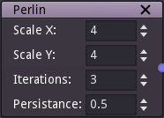

Perlin noise node
~~~~~~~~~~~~~~~~~

The Perlin noise node outputs a texture generated as a sum of Perlin noise functions
with increasing frequencies and decreasing amplitudes.

Inputs
++++++

The Perlin noise node does not accept any input.

Outputs
+++++++

The Perlin noise node provides a greyscale Perlin noise texture.

.. image:: images/perlin.png

Parameters
++++++++++

The Perlin noise node accepts the following parameters:

* *Scale X* and *Scale Y* are the subdivisions of the first iteration

* *Iterations* is the number of iterations

* *Persistance* is the ratio between the amplitude of subsequent iterations. Lower values
  of persistance generate smoother textures.

Notes
+++++

As with all random nodes, the seed is held by the node's position, so moving the node in the graph
will modify the texture, and the outputs will remain the same if its position and parameters
are not changed.
