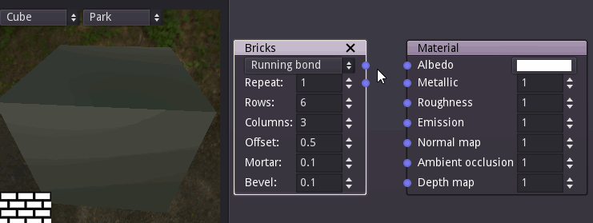

User interface
==============

Overview
--------

Material Maker mainly consists of 3 panes:

* The top left pane is the library, that contains all available nodes that can be used
  to create materials. Library items are shown in a tree view

* The bottom left pane is the preview, that shows at the same time the current material
  applied to a sample mesh in a sample environment, and the texture generated by the
  currently selected node

* The right pane contains the graph editors where materials are described for current
  projects

First steps with the user interface
-----------------------------------

When opening Material Maker, a new empty project is created and shown in the right pane.
An empty project simply consists of a material node where textures for all elements of
the material should be connected.

To create a new node, simply choose one (for example "bricks") from the library (the
top left pane) and drag it into the graph editor. Depending on the selected library
item, a preview or a simple description will be displayed while dragging.

.. image:: images/create_node.gif

Selecting this new node (by clicking on it) shows it in the preview pane. The very small
2d preview of the preview pane can be maximized by double clicking on it. This will hide
the 3d preview but is useful when working on the different textures of the material.

To connect a node output to an input of another node, simply drag one to the other.
For example we can drag the first output of the Bricks node to the albedo input of
the Materials node. This will automatically assign the simple Bricks texture to the
albedo element of the material, and the 3d preview will immediately be updated (if
you maximized the 2d preview it can be minimized by double-clicking on it again).

Nodes can easily be configured by modifying their parameters, and previews are updated
automatically.

Since each input can be connected to a single output, reconnecting an input will
automatically remove the previous connection.

Main menu
---------

The main menu is organized in 4 sections:

* the *File* menu contains actions to create, load, save and export materials
* the *Edit* menu has common edit actions cut, copy and paste
* the *Tools* menu has actions to add items to the user library
* the *Help* menu can be used to find more information and submit feedback about the software

File menu
^^^^^^^^^

* *New material* creates a new material and opens a tab in the right pane to edit it

* *Load material* opens a file dialog to select a procedural material (.ptex) file. If
  a material file is selected, it will be open in a new tab in the right pane. If the current
  tab contains an empty material (about material that only consists of a Material node), the
  material will be loaded into this tab.
 
* *Save material* saves the current material. If it was not previously saved, a file dialog
  will be displayed to select a location and file name.

* *Save material as* prompts for a location and file name and saves the current material.

* *Save all materials* saves all currently open materials. Materials that were not already
  saved ae ignored.

* *Export material* generates PNG image files for all elements of the material. File names are
  defined using the path of the material and their role (albedo, metallic...) in the material.

* *Close material* closes the current material.

* *Quit* closes the software.

Edit menu
^^^^^^^^^

* *Cut* Copies the selected nodes to the clipboard and removes them from the current material.

* *Copy* Copies the selected nodes to the clipboard

* *Paste* Copies the clipboard into the current material. Note that the nodes will be added to
  the center of the view, so it is advised to scroll to the correct location before pasting.
  Pasting also unselects all previously selected nodes and selects all newly created nodes,
  so they can easily be moved around.

Tools menu
^^^^^^^^^^

* *Add selected node to user library* first prompts for an item name. If a name is entered and
  confirmed, the selected nodes in the current material will be added to the user library under
  that name. Don't forget to use the *Save user library* item, otherwise the newly created library
  not be available anymore when the software is restarted.

* *Save user library* saves the user library.

Help menu
^^^^^^^^^

* *Report a bug* opens a web browser on the Issues page of Material Maker's GitHub project. Please
  do not hesitate to use it to suggest improvements for Material Maker.

* *About* Shows the about dialog.

