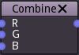

Combine node
~~~~~~~~~~~~

The combine three greyscale inputs into a color output texture.

Inputs
++++++

The combine node has 3 inputs, one for each (read, green and blue) channel.

Outputs
+++++++

The combine node outputs a color image.
