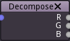

Decompose node
~~~~~~~~~~~~~~

The decompose node decomposes a color input into three greyscale outputs.

Inputs
++++++

The decompose node has a single color input.

Outputs
+++++++

The decompose node outputs 3 greyscale images, one for each (red, green and blue) channel.