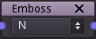

Emboss node
~~~~~~~~~~~

The emboss node generates an image that simulates lighting on its input.

Inputs
++++++

The emboss node has a single input.

Outputs
+++++++

The emboss node outputs the result of the emboss operation.

Parameters
++++++++++

The emboss node has a single parameter that defines the position of the light source used for the emboss effect.

Notes
+++++

This node outputs an image that has a fixed size.
