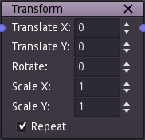

Transform node
~~~~~~~~~~~~~~

The transform node applies a scale operation, a rotation and a translation to the input image.

Inputs
++++++

The transform node accepts a single image as input.

Outputs
+++++++

The transform node outputs the transformed image.

The input image is first rotated around its center, then the scale operation is applied and
finally the translation.

Using the scale operation to zoom on a detail of the input image is only recommended if the
input does not rely on resolution dependant nodes.

Parameters
++++++++++

The transform node has the following parameters:

* *Translate X* and *Translate Y* define the translation.

* *Rotate* define the rotation expressed in degrees.

* *Scale X* and *Scale Y* define the scale operations along the X and Y axes.

* If *Repeat* is checked, zooming out will repeat the image, otherwise it will be clamped.
