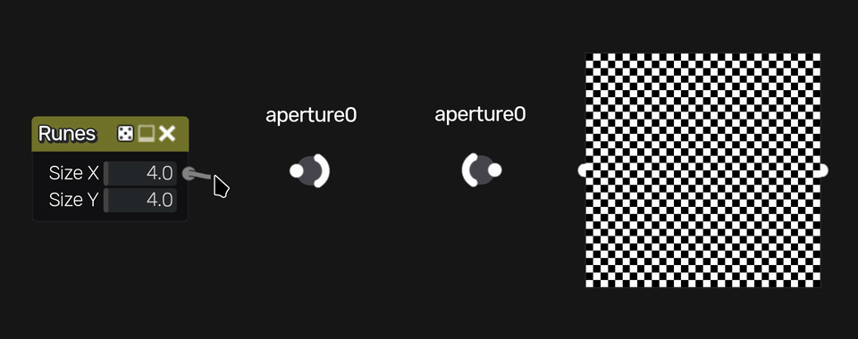

Aperture Nodes
~~~~~~~~~~~~~~

**Aperture** nodes can be used to make connections
without a visible link.

In/Out nodes are connected via an unique reference. This can be
set by double-clicking on the node/its label or pressing F2/Enter
when the node is selected.

