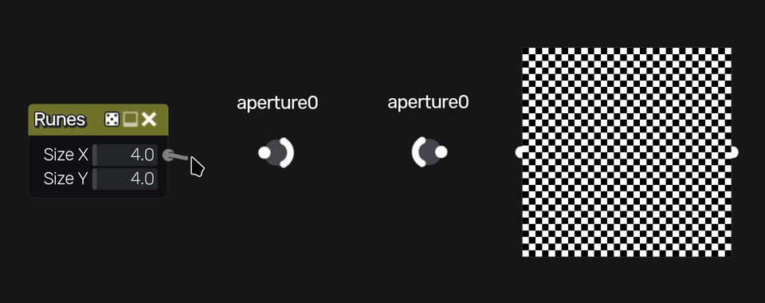

Aperture Nodes
~~~~~~~~~~~~~~

**Aperture** nodes can be used to make connections
without a visible link.

	

In/Out nodes are connected via an identifier displayed as a
label on top of the node. This can be set by double-clicking the
node/label or pressing F2/Enter when a node is selected.

Label color can be changed by pressing F when a node is selected.

While multiple output nodes can use the same identifier to reference
the same input node, input nodes must use unique(to the current graph/subgraph) identifiers.

