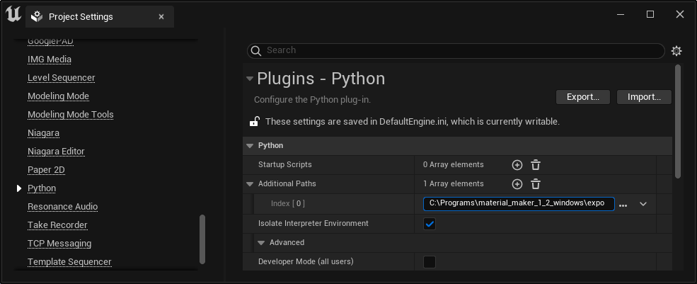

.. _export-section:

Exporting Materials
===================

When exporting a material, using either the Export submenu or the command line arguments,
Material Maker generates PNG image files for all elements of the material as well as
specific files for the target game engine.

In all cases, the generated PNG files (and especially the normal map) are generated in the
correct format.

Godot game engine
-----------------

When exporting for the Godot game engine, Material Maker will generate a .tres file that
describes a fully configured SpatialMaterial.

Unity game engine
-----------------

When exporting for the Unity game engine, Material Maker will generate a .mat file that
describes a fully configured material. It is thus possible to export materials directly
into one of your project assets directory, and Unity will automatically detect the newly
exported materials.

Depending on the Material node type, several Unity targets may be available.

Unreal game engine
------------------

Unreal Engine 4
^^^^^^^^^^^^^^^

When exporting for the Unreal game engine version 4.x, Material Maker will only
generate PNG images and a .mm2ue file. The material must be built manually inside
the Unreal Engine editor by following the instructions in this file.

This will generally consist in:

* Copying a material file from the **export** directory in Material Maker installation

* in the newly created material:

  * assigning generated textures

  * copying the shader generated in the .mm2ue file into a Custom node

  * creating new inputs in the custom node and TextureObject nodes, assigning the textures and connecting them

.. image:: images/unreal_export.png
  :align: center

Unreal Engine 5
^^^^^^^^^^^^^^^

When exporting for the Unreal game engine version 5.x, Material Maker will generate a
Python script that creates the material in Unreal.

Initial setup
~~~~~~~~~~~~~

Before exporting a material, it is necessary to configure a python path in Unreal for
Material Maker:

* in Unreal Engine, open the Project Settings window using the **Edit/Project Settings...** menu

* in this window, type "Python" in the search bar or select the **Plugins/Python** section

* in the **Additional paths** array, add the full path of the **export** directory of your Material Maker installation

* Unreal Engine will prompt to restart. When this is done, the project is ready to import generated materials

Exporting materials
~~~~~~~~~~~~~~~~~~~

When exporting a material for Unreal Engine 5, Material Maker will generate a python script,
texture files and a shader file, and will store the full path of the script into the clipboard,
so you just have to paste it into Unreal's 5 Python prompt and execute it to create the material.

When exporting, the target path is not that important (all necessary files will be imported into
the Unreal project), but the file name will be used as material name.
