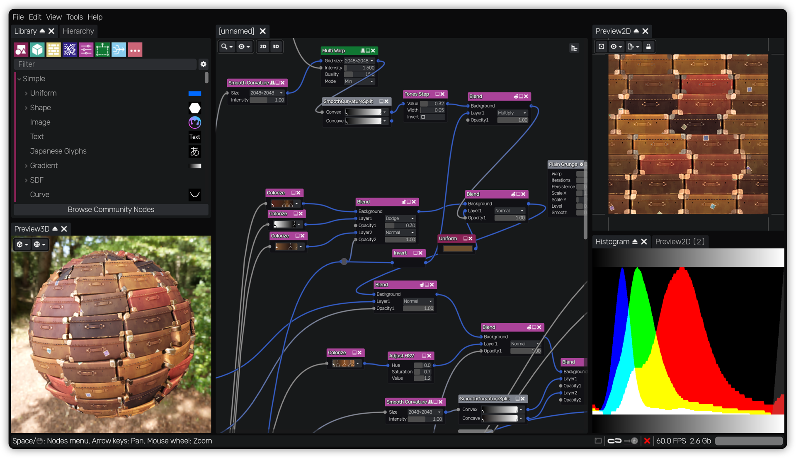

Introduction
============

Material Maker is a PBR procedural material editor as well as a texture painting tool based on
the Godot Engine.

As a procedural procedural material authoring tool, it can be used to describe the textures
that define a material by interconnecting basic nodes that generate, transform, filter or
combine their input textures in a graph.

As a texture painting tool, it provides a way to describe brushes using the same nodes,
and paint directly on 3D models.

Being based on the Physically Based Rendering approach, Material Maker can be used to
describe the Albedo, Metallic, Roughness, and Emission channels of a material, as well
as a normal and a Depth map. Those channels can also be painted on 3D models in the
painting tool.
