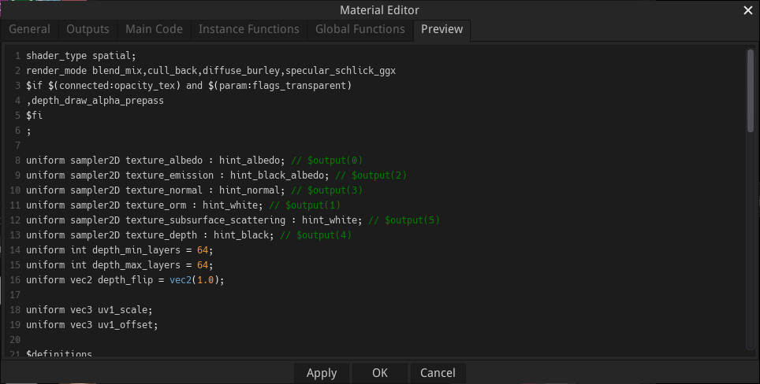

Material nodes
--------------

Material nodes are a specific type of shader nodes, with the following differences:

* their outputs cannot be connected in the material graph, but are used to generate
  image files when exporting

* they define a preview shader used in the Preview Panel and to generate preview for
  the website

* they define export targets for the material

There can be only one material node in a material graph.

The type of material can be modified using the context menu. Custom material nodes
can also be copied and pasted using this menu.

A material node can be made editable using the *Control+W* keyboard shortcut.
This shows buttons to edit, load and save the node.

Editing a material node will show the **Material Editor** window.

Creating and modifying Material nodes
^^^^^^^^^^^^^^^^^^^^^^^^^^^^^^^^^^^^^

Material nodes have a node editor dialog similar to the shader node editor, with an
additional **Preview** tab where a shader can be defined for the 3D preview of the
material.

The preview shader must be specified using the Godot Shading Language for the
3D preview.

Specific directives can be used to insert code generated from inputs and parameters:

* **$if** directives can be used to define conditional sections in the preview shader,
  and the conditional expressions can check parameter values (using the **$(param:param_name)**
  syntax) and if input ports are connected (using the **$(connected:port_name)**
  syntax).
* uniforms of type sampler2D can be assigned a generated texture, defined by an output,
  specified by adding **$output(output_index)** as comment after the uniform declaration. 
* **$begin_generate** /  **$end_generate** can be used to define sections where
  parameters and inputs (prtefixed with a $ character) are replaced with
  corresponding generated code.
* **$definitions** can be used to generate all definitions (of uniforms, functions,
  etc.) necessary for all generated code.

Adding and modifying export targets
^^^^^^^^^^^^^^^^^^^^^^^^^^^^^^^^^^^

Material nodes can be assigned export targets to generate materials for various
game engines and tools. Those export targets can be defined using the **Edit
export targets** entry of the node's context menu, that will show the **Material
Export Editor** window.

.. image:: images/material_editor_export.png
	:align: center

The **Material Export Editor** window consists of:

* a toolbar where targets can be selected, duplicated, renamed, loaded and saved

* an **Export** tab where export targets can be created with the definition of all
  files that must be generated

* a **Custom** tab where text filter functions can be defined in GDScript to be used
  in the export templates 

Export Editor Toolbar
~~~~~~~~~~~~~~~~~~~~~

The export editor toolbar has buttons and controls, from left to right, to:

* Create a new export target

* Load an export target from a file (this option does not check that the export target is
  suited for the current material, so it can exsily be used to adapt existing targets to
  another material node type)

* Select the current export target

* Rename the current export target

* Specify if the current export target should be stored in the material or as a separate
  file (this option is only available for default material types)

* Save the current export target to a file. Files saved using this option can be loaded
  using the load button of the Export Editor, or installed by dropping the file into
  the Material Maker application window

* Duplicate the current export target

* Delete the current export target

* Select the - the current export target

Exports tab
~~~~~~~~~~~

The exports tab can be used to create export targets for the material.

Export targets can be created, removed, duplicated, and their main file extension
defined. 

For each export target, it is possible to define several generated files.

Each file has a name (where **$(path_prefix)** is replaced), and an optional
condition that can be used to skip useless generated files. Supported conditions
are in the form **$(connected:input_name)**.

Files also have a **Prompt overwrite** option that makes it possible to not
overwrite them when exporting (this is useful when you manually updated an
exported material).

There are 4 types of generated files:

* Texture files, that are defined by an output index. The corresponding output
  will be rendered and saved as a file. Supported formats are PNG and EXR.

* Template files are text files, modified using the following directives:

  * **$begin_generate** / **$end_generate** can be used to define sections where
    parameters and inputs (prtefixed with a $ character) are replaced with
    corresponding generated code. Those sections accept a list of keywords that
    describe text filters to be applied to the section. Predefined filters are
    **float_uniform_to_const**, **rename_buffers**, **unity**, **unreal**...
  
  * **$definitions** can be used to generate all definitions (of uniforms, functions,
    etc.) necessary for all generated code. Filters are also accepted.
  
  * **$if** / **$fi** sections can be used to remove parts of the generated files,
    using the file condition syntax described above.

  * **$begin_buffers** / **$end_buffers** sections repeat their contents for each
    buffer used in generated shaders. In those sections, **$(file_prefix)** and 
    **$(buffer_index)** will be replaced with their values.

* All files have a 
  
* Buffer files are similar to Texture files and are generated for each
  buffer used in generated shaders. In the file name, **$(file_prefix)** and 
  **$(buffer_index)** will be replaced with their values.

* Buffer templates are Templates defined for each buffer used in generated shaders.

Custom
~~~~~~

The custom tab can be used to create custom text filters for **$begin_generate** /
**$end_generate** and **$definitions** sections in GDScript.
