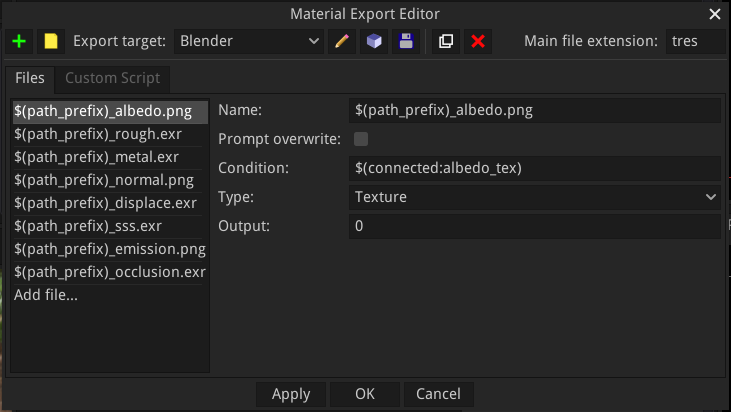

Material nodes
--------------

Material nodes are a specific type of shader nodes, with the following differences:

* their outputs cannot be connected in the material graph, but are used to generate
  image files when exporting

* they define a preview shader used in the Preview Panel and to generate preview for
  the website

* they define export targets for the material

There can be only one material node in a material graph.

A material node can be made editable using the *Control+W* keyboard shortcut.

Editing a material node will show the **Material Editor** window.

Creating and modifying Material nodes
^^^^^^^^^^^^^^^^^^^^^^^^^^^^^^^^^^^^^

Material nodes have a node editor dialog with additional tabs:

* a **Preview** tab where a shader can be defined for the 3D preview of the material

* an **Export** tab where export targets can be created with the definition of all
  files that must be generated

* a **Custom** tab where text filter functions can be defined in GDScript to be used
  in the export templates 

.. image:: images/material_editor_general.png
	:align: center

Preview
~~~~~~~

The preview tab can be used to define a shader in Godot Shading Language for the
3D preview.

Specific directives can be used to insert code generated from inputs and parameters:

* **$begin_generate** /  **$end_generate** can be used to define sections where
  parameters and inputs (prtefixed with a $ character) are replaced with
  corresponding generated code.
* **$definitions** can be used to generate all definitions (of uniforms, functions,
  etc.) necessary for all generated code.

Exports
~~~~~~~

The exports tab can be used to create export targets for the material.

Export targets can be created, removed, duplicated, and their main file extension
defined. 

For each export target, it is possible to define several generated files.

Each file has a name (where **$(path_prefix)** is replaced), and an optional
condition that can be used to skip useless generated files. Supported conditions
are in the form **$(connected:input_name)**.

There are 4 types of generated files:

* Texture files, that are defined by an output index. The corresponding output
  will be rendered and saved as a file. Supported formats are PNG and EXR.

* Template files are text files, modified using the following directives:

  * **$begin_generate** / **$end_generate** can be used to define sections where
    parameters and inputs (prtefixed with a $ character) are replaced with
    corresponding generated code. Those sections accept a list of keywords that
    describe text filters to be applied to the section. Predefined filters are
    **float_uniform_to_const**, **rename_buffers**, **unity**, **unreal**...
  
  * **$definitions** can be used to generate all definitions (of uniforms, functions,
    etc.) necessary for all generated code. Filters are also accepted.
  
  * **$if** / **$fi** sections can be used to remove parts of the generated files,
    using the file condition syntax described above.

  * **$begin_buffers** / **$end_buffers** sections repeat their contents for each
    buffer used in generated shaders. In those sections, **$(file_prefix)** and 
    **$(buffer_index)** will be replaced with their values.
  
* Buffer files are similar to Texture files and are generated for each
  buffer used in generated shaders. In the file name, **$(file_prefix)** and 
  **$(buffer_index)** will be replaced with their values.

* Buffer templates are Templates defined for each buffer used in generated shaders.

Custom
~~~~~~

The custom tab can be used to create custom text filters for **$begin_generate** /
**$end_generate** and **$definitions** sections in GDScript.
