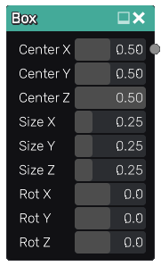

Box node
~~~~~~~~

The **Box** node outputs a greyscale image that represents the depth of a 3D box.

Inputs
++++++

The **Box** node does not accept any input.

Outputs
+++++++

The **Box** node provides an output that generates a greyscale image showing the
selected 3D box.

Parameters
++++++++++

The **Box** node has the following parameters:

* the *box center position* as X, Y and Z coordinates
* the *box size* along X, Y and Z axes
* the *rotation of the box* around X, Y and Z axes

Example images
++++++++++++++

.. image:: images/node_3d_box_samples.png
	:align: center
