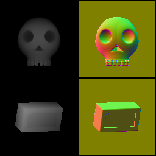

3D signed distance function geometry nodes
~~~~~~~~~~~~~~~~~~~~~~~~~~~~~~~~~~~~~~~~~~

The signed distance function nodes can be used to define complex 3D geometry using simple
shapes.

They are based on a very small set of basic shapes, that can be combined using operators,
and finally output as a greyscale heightmap and a color normal map using the **render** node.

Describing 3D objects using SDF primitives is more difficult than using existing meshes, but this
method integrates smoothly with shader generation, and (as many nodes in Material Maker) is
resolution independant.

All shapes can be associated to a color index that can be used to apply different (2D or 3D) textures
to the result.

All output samples shown in this section are preview images.

All Signed Distance Functions nodes are based on code written by Inigo Quilez that can be found
`on this page`__.

.. _sdf3dpage: https://www.iquilezles.org/www/articles/distfunctions/distfunctions.htm

__ sdf3dpage_

.. toctree::
	:maxdepth: 1

	node_3d_sdf_render
	node_3d_sdf_color

Shapes
++++++

.. toctree::
	:maxdepth: 1

	node_3d_sdf_shapes_sphere
	node_3d_sdf_shapes_box
	node_3d_sdf_shapes_cylinder
	node_3d_sdf_shapes_capsule
	node_3d_sdf_shapes_cone
	node_3d_sdf_shapes_torus
	node_3d_sdf_shapes_plane
	node_3d_sdf_shapes_angle

Operators
+++++++++

.. toctree::
	:maxdepth: 1

	node_3d_sdf_operators_boolean
	node_3d_sdf_operators_smoothboolean
	node_3d_sdf_operators_rounded
	node_3d_sdf_operators_elongation
	node_3d_sdf_operators_repeat
	node_3d_sdf_operators_circlerepeat
	node_3d_sdf_operators_extrusion
	node_3d_sdf_operators_revolution
	node_3d_sdf_operators_morph
	node_3d_sdf_operators_sdf_fbm

Transforms
++++++++++

.. toctree::
	:maxdepth: 1

	node_3d_sdf_transforms_translate
	node_3d_sdf_transforms_scale
	node_3d_sdf_transforms_rotate

Example images
++++++++++++++

