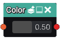

Color node
..........

The **Color** node assigns a color index to the 3D signed distance function it receives as input.
The color index map is generated when rendering the 3D scene using the **Render** node and can be
used later to assign different materials to different shapes.

Inputs
::::::

The **Color** node accepts 1 input in 3D signed distance function format.

Outputs
:::::::

The **Color** node generates a colored signed distance function.

Parameters
::::::::::

The **Color** node accepts the color index (a float value between 0 and 1) that will be assigned.
