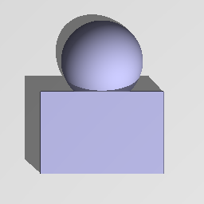

Boolean node
............

The **Boolean** node generates a 3D signed distance function for the combination (union,
intersection or difference) of its inputs.

.. image:: images/node_sdf3d_boolean.png
	:align: center

Inputs
::::::

The **Boolean** node accepts 2 inputs in 3D signed distance function format.

Outputs
:::::::

The **Boolean** node generates a signed distance function of the
combination of its inputs.

Parameters
::::::::::

The **Boolean** node accepts *the operator it applies (union, intersection or
difference)* as parameter.

Example images
::::::::::::::

