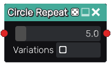
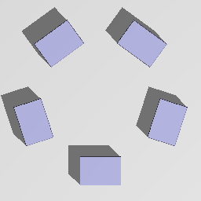

CircleRepeat node
.................

The **CircleRepeat** node generates a 3D signed distance image of a circular repetition of its
input. The source object must be offset in the positive Y direction from the center.

Inputs
::::::

The **CircleRepeat** node accepts an input in 3D signed distance function format.

Outputs
:::::::

The **CircleRepeat** node generates a signed distance function of the
repeated version of the input shape.

Parameters
::::::::::

The **CircleRepeat** node accepts the following parameters: 

* *Count* controls the number of copies of the input
* *Variations* controls whether the input is sampled with variations

Example images
::::::::::::::

