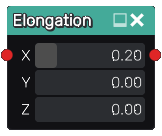

Elongation node
...............

The **Elongation** node generates a 3D signed distance function of a shape
based on its input that has been elongated from its center.

Inputs
::::::

The **Elongation** node accepts an input in 3D signed distance function format.

Outputs
:::::::

The **Elongation** node generates a signed distance function of the
elongated version of the input shape.

Parameters
::::::::::

The **Elongation** node accepts 3 X, Y and Z parameters that specify the elongation amount along each axis.

Example images
::::::::::::::

