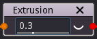
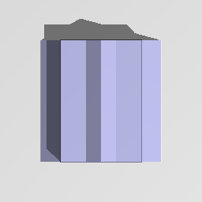

Extrusion node
..............

The **Extrusion** node generates a 3D signed distance function of a shape based on
its (2D signed function) input extruded along the Y axis.

Inputs
::::::

The **Extrusion** node accepts an input in 2D signed distance function format.

Outputs
:::::::

The **Extrusion** node generates a signed distance function of the
extruded version of the input shape.

Parameters
::::::::::

The **Extrusion** node accepts the *the length* of the extruded shape as parameter. 

Example images
::::::::::::::

