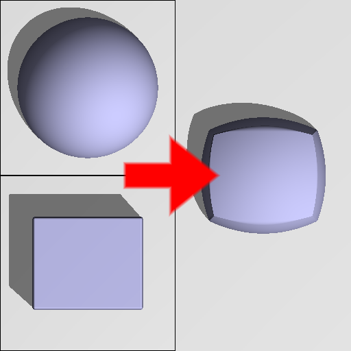

Morph node
..........

The **Morph** node generates a 3D signed distance function obtained by mixing two input
3D signed distance functions.

.. image:: images/node_sdf3d_morph.png
	:align: center

Inputs
::::::

The **Morph** node accepts 2 inputs in 3D signed distance function format.

Outputs
:::::::

The **Morph** node generates a signed distance function of the
combination of its inputs.

Parameters
::::::::::

The **Morph** node accepts *the mix factor* as parameter.

Example images
::::::::::::::

