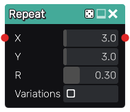
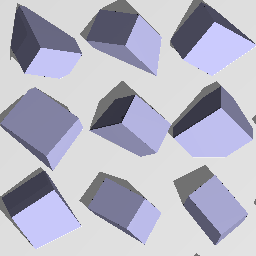

Repeat node
...........

The **Repeat** node generates a 3D signed distance image of a repetition of its
input on the X and Y axes. It can also apply a random rotation to the repeated
object instances.

Inputs
::::::

The **Repeat** node accepts an input in 3D signed distance function format.

Outputs
:::::::

The **Repeat** node generates a signed distance function of the
repeated version of the input shape.

Parameters
::::::::::

The **Repeat** node accepts the following parameters:

* *the repetition offset* for both X and Y axes
* *the amount of random rotation* applied to all instances

Example images
::::::::::::::

