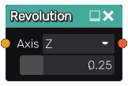

Revolution node
...............

The **Revolution** node generates a 3D signed distance function of a shape based on
the revolution along the Z axis of its (2D signed function) input.

Inputs
::::::

The **Revolution** node accepts an input in 2D signed distance function format.

Outputs
:::::::

The **Revolution** node generates a signed distance function of the
revolution of the input shape.

Parameters
::::::::::

The **Revolution** node accepts the *the radius* of the revolution operation as parameter. 

Example images
::::::::::::::

.. image:: images/node_sdf3d_revolution_sample.png
	:align: center
