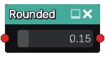
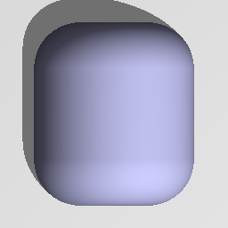

Rounded node
............

The **Rounded** node generates a 3D signed distance function of a rounded shape
based on its input, by substracting a constant from its input (i.e.
"growing" it towards the outside).

Inputs
::::::

The **Rounded** node accepts an input in 3D signed distance function format.

Outputs
:::::::

The **Rounded** node generates a signed distance function of the
rounded version of the input shape.

Parameters
::::::::::

The **Rounded** node accepts the following parameters:

* *the distance* to be substracted from the function

Example images
::::::::::::::

