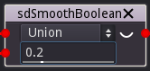

SmoothBoolean node
..................

The **SmoothBoolean** node generates a 3D signed distance image for the combination (union,
intersection or difference) of its inputs.

Inputs
::::::

The **SmoothBoolean** node accepts 2 inputs in signed distance function format.

Outputs
:::::::

The **SmoothBoolean** node generates a signed distance function of the
combination of its inputs.

Parameters
::::::::::

The **SmoothBoolean** node accepts the following parameters:

* *the operator it applies (union, intersection or difference)*
* *the smoothness* of the operation

Example images
::::::::::::::

.. image:: images/node_sdf3d_smoothboolean_sample.png
	:align: center
