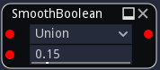
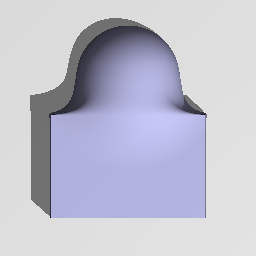

SmoothBoolean node
..................

The **SmoothBoolean** node generates a 3D signed distance image for the combination (union,
intersection or difference) of its inputs. If the input shapes are associated to color indexes, the
smooth boolean node applies them to the output.

Inputs
::::::

The **SmoothBoolean** node accepts two or more inputs in signed distance function format.

This node is variadic, and more shapes can be added.

Outputs
:::::::

The **SmoothBoolean** node generates a signed distance function of the
combination of its inputs.

Parameters
::::::::::

The **SmoothBoolean** node accepts the following parameters:

* *the operator it applies (union, intersection or difference)*
* *the smoothness* of the operation

Example images
::::::::::::::

