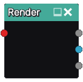

Render node
...........

The **Render** node generates images from a 3D signed distance function inputs.

Inputs
::::::

The **Render** node accepts an input in 3D signed distance function format.

Outputs
:::::::

The **Render** node generates two images from its input:

* a *height map* of the rendered input along the Z axis
* a *normal map* of the rendered input calculated directly
  using the 3D signed function (and consequently more
  accurate than a normal map generated from the height map)

Parameters
::::::::::

The **Render** node does no accept any parameter.
