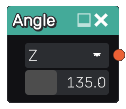

Angle node
..........

The **Angle** node generates a 3d signed distance function for two planes that form a given angle.
It has little use on its own and will generatty be used to cut or intersect other shapes.

Inputs
::::::

The **Angle** node does not accept any input.

Outputs
:::::::

The **Angle** node generates a signed distance function for both planes.

Parameters
::::::::::

The **Angle** node accepts as parameters the axis and value of the angle.
