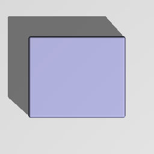

Box node
........

The **Box** node generates a 3d signed distance function for a box with rounded corners.

.. image:: images/node_sdf3d_box.png
	:align: center

Inputs
::::::

The **Box** node does not accept any input.

Outputs
:::::::

The **Box** node generates a signed distance function for a box.

Parameters
::::::::::

The **Box** node accepts the following parameters:

* the X, Y and Z sizes of the box (not including the rounded corners and edges)
* the radius of the rounded corners and edges

Example images
::::::::::::::

