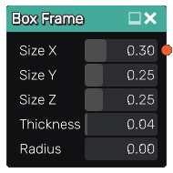

Box Frame node
..............

The **Box Frame** node generates a 3d signed distance function for a box frame.

Inputs
::::::

The **Box Frame** node does not accept any input.

Outputs
:::::::

The **Box Frame** node generates a signed distance function for a box frame.

Parameters
::::::::::

The **Box Frame** node accepts the following parameters:

* The X, Y and Z sizes of the box (not including the rounded corners and edges).

* The **Thickness** of the frame.

* The **Radius** of the rounded corners and edges.

Example images
::::::::::::::

