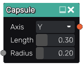

Capsule node
............

The **Capsule** node generates a 3d signed distance function for a capsule.

Inputs
::::::

The **Capsule** node does not accept any input.

Outputs
:::::::

The **Capsule** node generates a signed distance function for a capsule.

Parameters
::::::::::

The **Capsule** node accepts as parameters the length of the capsule and its radius.

Example images
::::::::::::::

