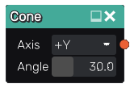

Cone node
............

The **Cone** node generates a 3d signed distance function for an infinite cone.

Inputs
::::::

The **Cone** node does not accept any input.

Outputs
:::::::

The **Cone** node generates a signed distance function for a cone.

Parameters
::::::::::

The **Cone** node accepts as parameters the *angle* of the cone.

Example images
::::::::::::::

