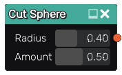

Cut Sphere node
...............

The **Cut Sphere** node generates a 3d signed distance function for a sphere cut by a plane.

Inputs
::::::

The **Cut Sphere** node does not accept any input.

Outputs
:::::::

The **Cut Sphere** node generates a signed distance function for a sphere cut by a plane.

Parameters
::::::::::

The **Cut Sphere** node accepts the following parameters:

* The **Radius** of the sphere.

* The **Amount** defines the portion of the sphere to be cut.

Example images
::::::::::::::

