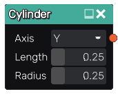

Cylinder node
.............

The **Cylinder** node generates a 3d signed distance function for a cylinder.

Inputs
::::::

The **Cylinder** node does not accept any input.

Outputs
:::::::

The **Cylinder** node generates a signed distance function for a cylinder.

Parameters
::::::::::

The **Cylinder** node accepts as parameters the length of the cylinder and its radius.

Example images
::::::::::::::

.. image:: images/node_sdf3d_cylinder_sample.png
	:align: center
